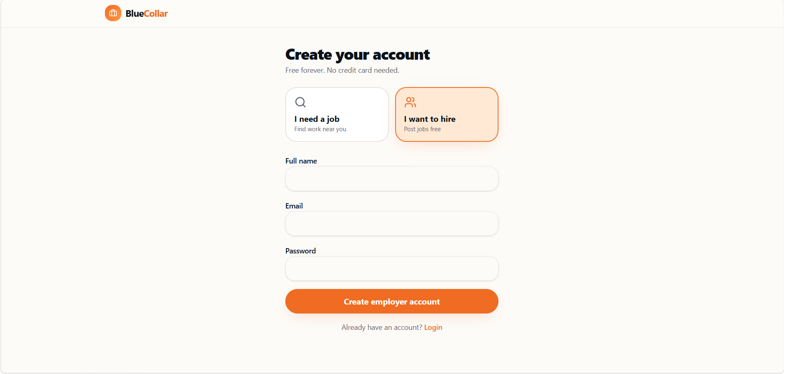

# Kamai Chalo Jobs 

*A mobile-first job marketplace connecting blue-collar workers and employers in India.*

Built as part of a 24-hour hackathon focused on solving real-world hiring challenges in India’s blue-collar job market.

##  What This Project Solves

India’s blue-collar hiring process is fragmented, slow, and heavily dependent on middlemen.

This platform simplifies it into a direct flow:

* Workers can discover and apply for jobs instantly
* Employers can post jobs and manage applicants in one place
* Everything is optimized for mobile-first, low-friction usage

##  Key Features

###  Worker Experience (Job Seekers)

* One-tap onboarding with role-based authentication
* Smart job feed based on location, category, and experience
* Instant job application (no lengthy forms)
* Save jobs for later viewing
* Track application status (Applied → Shortlisted → Hired/Rejected)
* Profile-based job matching (skills, salary expectation, experience)

###  Employer Experience

* Company onboarding with verification-ready structure
* Post jobs using guided step-by-step flow
* Manage applicants in a structured dashboard
* Shortlist / reject candidates in one click
* View applicant match quality (based on profile-job fit)
* Track active jobs and hiring funnel

###  Platform Capabilities

* Role-based access control (Worker / Employer)
* Secure authentication using Supabase
* Row Level Security (RLS) for data protection
* Fully responsive mobile-first UI
* Reusable component architecture (shadcn/ui based)
* Clean routing with TanStack Router

##  System Design Highlights (Important for Interviews)

* **Role-based architecture** instead of generic user model
* **Separation of concerns**: Workers vs Employers vs Public routes
* **Secure DB access using RLS policies (Supabase)**
* **Client-side matchmaking logic for job recommendations**
* **Scalable schema design for jobs, applications, and profiles**

##  Tech Stack

**Frontend**

* React 19 + TypeScript
* TanStack Start (SSR framework)
* TanStack Router + Query
* Tailwind CSS
* shadcn/ui

**Backend**

* Supabase (Auth + PostgreSQL + Storage)
* Row Level Security (RLS)

**UI/UX**

* Mobile-first responsive design
* Component-driven architecture
* Reusable UI system (Radix + shadcn)

##  Screenshots

###  Landing Page

###  Login Page

###  Signup Page

###  Job Listings

###  Job Details

###  Employer Dashboard

###  Job Posting Flow

##  Folder Structure (Simplified)
text
src/
components/        # UI components (shadcn-based)
routes/            # App routes (TanStack Router)
hooks/             # Custom hooks
lib/               # Utilities & helpers
integrations/      # Supabase integration
styles/            # Global styles

##  Getting Started Locally

bash
git clone <repo-url>
cd kamai-chalo-jobs
npm install --legacy-peer-deps
npm run dev

Create `.env` file:

env
SUPABASE_URL=your_url
SUPABASE_PROJECT_ID=your_id
SUPABASE_PUBLISHABLE_KEY=your_key

VITE_SUPABASE_URL=your_url
VITE_SUPABASE_PROJECT_ID=your_id
VITE_SUPABASE_PUBLISHABLE_KEY=your_key

##  What Makes This Project Stand Out

* Real-world problem (not a toy CRUD app)
* Full role-based system (Worker vs Employer)
* Production-grade backend (Supabase + RLS)
* Clean UI system with reusable components
* Mobile-first UX designed for low-friction usage
* Scalable schema for future expansion

##  Future Improvements

* Real-time chat between workers and employers
* AI-based job matching score improvements
* Multi-language support (Hindi + regional languages)
* Resume parsing & auto-profile generation
* Payment-based job boosting system

##  Final Note

This is a working MVP built under time constraints.
The focus was on **end-to-end functionality, not over-engineering**.
